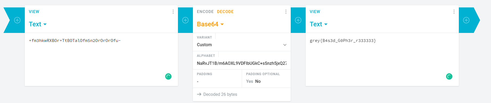

# Flappy-o

### Challenge Description

#### Flappy-o:

I know you cheated in flappy-js. This time the game is written in C, I don't think you can cheat so easily. Or can you?

Show me your skills by getting a score of at least 64.

MD5 (flappybird) = f1f36482358dc35992f076e6ea483df8

* daniellimws

#### Flappy-o 2:

This challenge uses the same binary as `flappy-o`.

Every 10000 points you reach, you unlock a character of the bonus flag. This is the real test of your skills.

MD5 (flappybird) = f1f36482358dc35992f076e6ea483df8

* daniellimws

### Challenge Details

In this challenge, we were given a 64 bit ELF file to work on and make the game show the flag for us:



Opening the program in a decompiler will show us the game loop:

.png>)

Basically here it shows all the handlers for the game from processing user input to drawing the current state of the game. For this challenge, I will probably be only interested in the updateAndDrawFlag since it probably relates to the flag.

Below is the flag function:

.png>)

For flag1, one character will be decrypted everytime `actualscore` is incremented while for flag2, 4 characters will be decrypted everytime `actualscore` is incremented by 10000.

What is important to note is that lfsr2 is also run everytime `actualscore` is incremented which uses some global variables which will affect genFlag2 which is the decrypt function for flag2:

.png>)

.png>)

lfsr2 is a seed generator that change everytime it is run, hence when solving flappy o2, this information is important also :D

### Challenge solution

Theres actually a lot of solutions to both of these challenges. One is to actually just patch it such that you don't die and remove the sleep run the game for a while (1000000 iq ngl xD)

For this writeup, I will be showing how to patch the game to get the flag (pAin)

#### Flappy o

For flappy o, simply change ++isScore in the game loop to score+= 8 by patching the following instructions:

.png>)

to ->

.png>)

Voila!

.png>)

flag: whatever is in that picture above^


Flappy o 2:

This one is a bit more tricky as we nid to account for the 10000 points sadness. For this we need to do the following:

1. Change score+=8 back to score += 1
2. Change actual score = score\*10000 (so that decryption will happen every tick xD)
3. patch such that lfsr2 will be run 10000 times per tick oso.

The first step is the easiest part of it:

.png>)

For the 2nd step, I had to change the `sar 3` for score to `imul 0x2710`to make it:

```
actualscore = score * 10000
```

and also remove the anticheat check as actual score will increment by 10000 by tick which is forbidden by the check as it only allows actual score to be incremented by 1 per tick:

.png>)

.png>)

to patch out the check, I changed the jz to an unconditional jump `jmp` to always execute the flag decryption function no matter what.&#x20;

.png>)

.png>)

For the last step, I have to remove the first flag decryption function to make way for the for loop I have to insert in to run lfsr2 10000 times. Heres the asm instructions I used:

```
mov    ecx, 0
cmp    ecx, 0x2710
jz      short loc_555899B6283F
mov     edi, 1
call    lfsr2
inc     ecx
jmp     short loc_555899B62829
```

This will form the for loop to call lfsr2 9999 times. Together with the lfsr2 that is called every tick, lfsr2 will be called 10000 times per tick!

Heres the final decompiled version of the patched flag function:

.png>)

Running the patched version will give us the flag:

.png>)

Flag: whatever is in that pic above XDDD
