# LockBit\_Report

### Introduction

This malware is a variant of the LockBit ransomware, which can be easily identified by the .lockbit extension appended to files encrypted by the malware. LockBit ransomware acts as a Ransomwareas-a-Service model, whereby developers distribute their own ransomware to affiliates who will then attempt to infect company network with the ransomware and extort a ransom from the company itself. The money extorted is then divided between the affiliates and developers, often in a 3:1 ratio or 2:1 ratio.

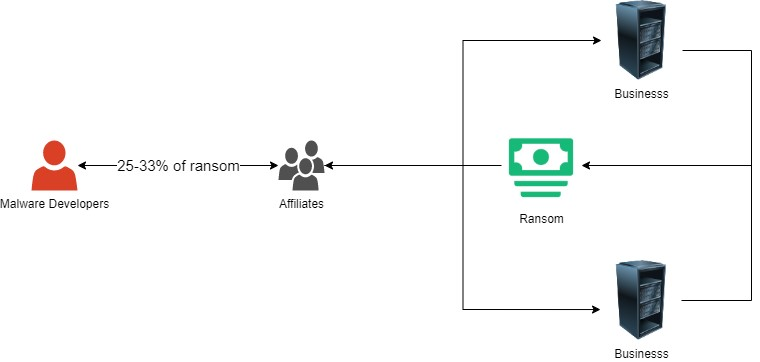

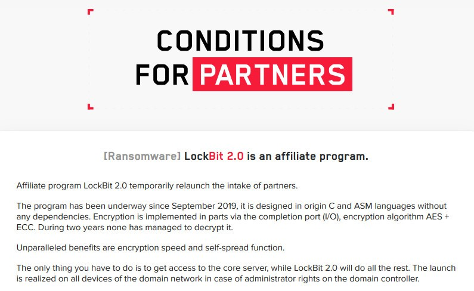

The malware usually enters a company network via phishing attacks or insider threats. It is then executed within the company network, preferably by someone who has high privileges within the company network to access more files. The malware will encrypt all accessible files (except for files that are blacklisted by the malware) and demand a ransom to decrypt the encrypted files.

This variant of the LockBit ransomware has the following features and functions:

* If run as admin, executes UAC bypass to elevate itself without notifying user
* Checks for AES instruction set and in chip RNG support on the processor's computer and use it if supported, increasing performance and security respectively
* Generates a RSA key pair which will then be encrypted by a hardcoded public key, both are saved into the registry to identify the victim
* Generates a 128-bit AES key and 128 bit IV for each file, encrypt the key using the RSA public key generated and append to encrypted file and then encrypt the file itself with the AES key
*   Writes ransom text to Restore-My-Files.txt in all directories with encrypted files.

    Sets background to a ransom text background
*   Evades detection by clearing logs, setting creation,modified,accessed time of files to 1/1/2000

    9.01am (UTC +8) and deleting itself after execution
* Prevents recovery by deleting shadow copies, System State backup, deleting all backups, disabling recovery mode
* Uses encrypted strings to hinder analysis of the program Here will be a flowchart illustrating the general flow of the malware:

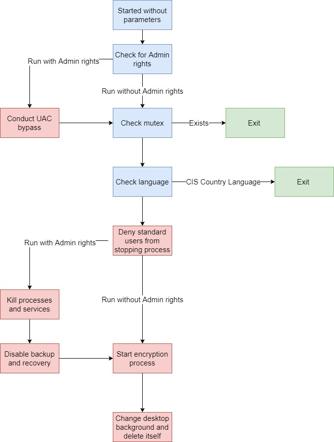

### Malware defenses

Throughout the malware, encrypted strings can be found:

In XMM registers

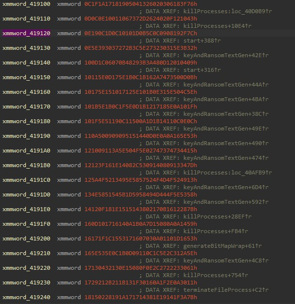

Or in the program itself:

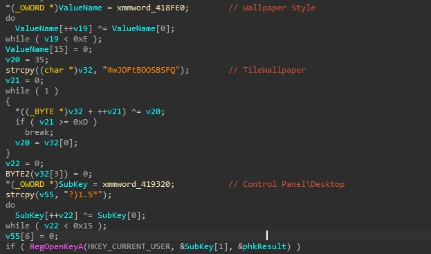

These strings usually contain debugging info or important stuff such as registry values/keys, name of services/processes, or other important values used in the malware.

Here is how each string is encrypted:

```
from random import randint
# suppose malware is encrypting the string "I am sad"
sad = randint(0,0xFF)
plaintext = "I am sad"
encrypted = []
encrypted.append(sad)
for x in plaintext
encrypted.push(ord(x) ^ sad)
```


Essentially, each string is encrypted with a randomly generated value. The resultant hex sequence produced will have the key as the first byte, followed by the encrypted data. There are various methods that the malware uses to decrypt the strings, the scripts used to decrypt each form of the malware can be found in Appendix A.

With the decrypted strings, analysing functions becomes much easier due to the information they provide such as debugging info, processes/services the malware is stopping or registry values the malware is trying to access.

### Start of malware

#### Check for parameters

When the malware is first started, it will first check for the presence of command line arguments. Normally malware will check for a specific argument before executing to prevent sandboxes from executing the malware directly, hiding its functionality from sandboxes. However this malware will force itself to crash when there is an argument passed into the file via entering a critical section that is not initialized. It is unclear whether if this is deliberate or a mistake from the developers.

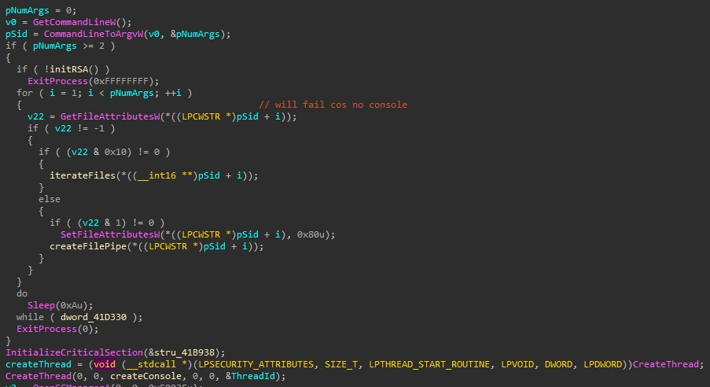

If there are no parameters passed into the malware, the program will now check the permissions provided by the current process. If the process is a member of the WinBuiltInAdministratorSid, it will now bypass UAC to achieve elevated rights via the elevated backdoor by CMSTPLUA and IColorDataProxy and run as Administrator.

#### UAC Bypass (Admin)

If the process is run by an Admin of the computer, it will now initiate the UAC bypass to give itself Administrator rights and bypassing any prompts that will be shown to the user. To achieve this, it requests for the CMSTPLUA object from the COM interface which has auto elevation rights:

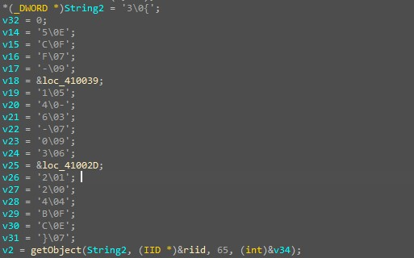

CLSID for CMSTPLUA found in malware

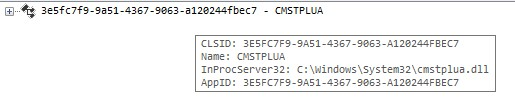

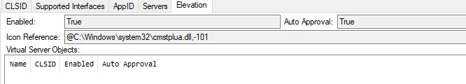

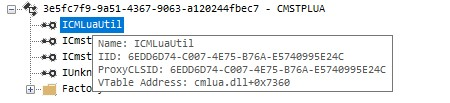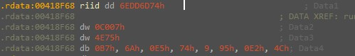

^ Riid for ICMLuaUtil

According to [https://github.com/hfiref0x/UACME,](https://github.com/hfiref0x/UACME) ICMLuaUtil has a function shell exec which can be utilized by attackers to run any command line commands. In this case, the command sets the DisplayCalibrator to the malware file path.

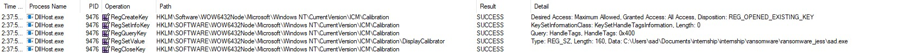

From there, the malware will proceed to call launchColorCPL from IColorDataProxy which like CMSTPLUA, also has auto elevation rights:

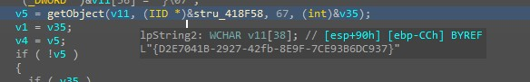

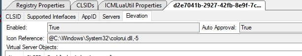

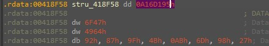

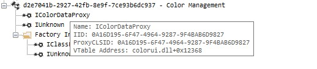

launchColorCPL will execute the custom display calibrator which was just set by the malware which will allow the malware to become elevated and access all files without prompting the user.

Once achieving elevation, the malware will now proceed to start the functionalities of the program.

#### Mutex

The malware uses a mutex to check whether if it has already started running on the machine to prevent reinfection. The mutex used by the malware is BEF590BE-11A6-442A-A85B656C1081E04C.

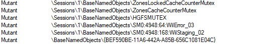

**Language of Host System.**

Other than checking the mutex, the malware also checks for the default language of the host machine. If the language belongs to any country in the CIS, it will automatically exit without harming the machine. This is done to prevent being prosecuted by the authorities in these countries

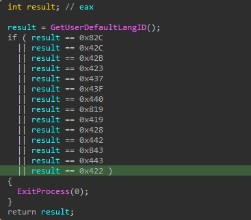


### Setting up the Environment

#### Preventing users from stopping the malware

The malware will add a access denied entry to its process for users belonging to the null sid. This prevents normal users that do not have administrator rights to stop the malware should it be run as a standard user.

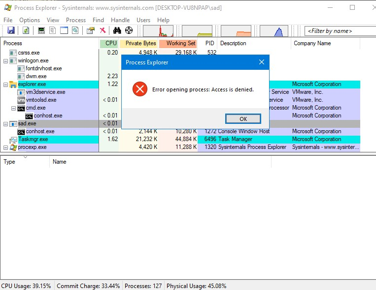

This will give the malware time to encrypt more files as the user contacts the administrator for help to end the process (if they found out that the malware is malicious in the first place)

#### Kill processes and services (When run as admin only)

The malware is also seen trying to stop/kill processes which usually relate to antivirus/backup service or storage services. Processes/services stopped are hardcoded in the program and will be shown in Appendix B. Such processes provides a chance for users to recover their lost files or detect the malware early on and kill it before any further damage can be done by the malware

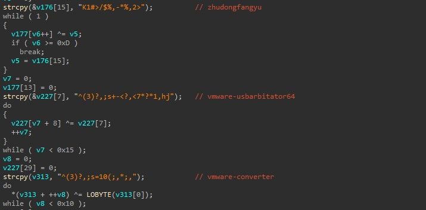


#### Removing all backups and disabling recovery (When run as admin only)

After killing processes and services relating to backup and antivirus, the malware will now attempt to run command prompt commands to remove all sources of backups generated by Windows itself.

Here are the commands called by the malware:

/c vssadmin delete shadows /all /quiet

wmic shadowcopy delete

bcdedit /set {default} bootstatuspolicy ignoreallfailures

bcdedit /set {default} recoveryenabled no

wbadmin delete catalog -quiet

wbadmin DELETE SYSTEMSTATEBACKUP -deleteOldest

wbadmin DELETE SYSTEMSTATEBACKUP

wevtutil cl security

wevtutil cl systen

wevtutil cl application

These commands will:

Delete all shadow copies found on the system, hence no rolling back of files via shadow copies can be done

Disable recovery to prevent automatic repair from running

Delete all backup catalogs found on the system, preventing recovery via backup catalogs

Delete All System State Backups, preventing sysadmins from recovering from restoring original

OS configuration before the malware was started

Clear all event logs to erase traces of the malware activity

Other than the above, the malware will also empty the recycle bin of all drives on the system, preventing the recovery of deleted files as a means of partial recovery

### Encrypt files

The following below will be the flow to encrypt files on the system:

Generate RSA key pair → Encrypt with hardcoded public key → Store RSA key pair in

HKCU\SOFTWARE\LockBit\full and HKCU\SOFTWARE\LockBit\public respectively → get all available drives on the system (local/network drives) → iterate files on each drive → generate AES key/IV bytes for each file → encrypt AES key/IV bytes with generated RSA key pair→ append encrypted info to plaintext file → Encrypt files with AES key and append .lockbit extension to files →

Set creation, modified, accessed time to 1/1/2000 9.01am (UTC +8) → Add ransom text into

"Restore-My-Files.txt" for all directories encrypted

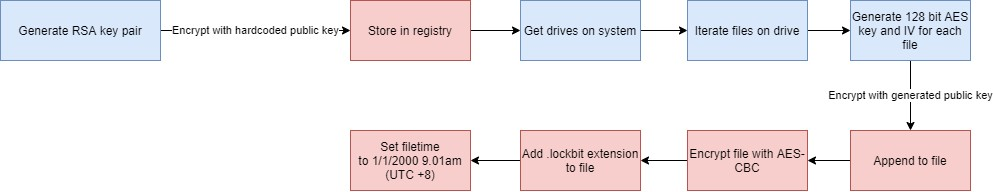

The malware utilizes a 4096 bit RSA key do the encryption of the keys while file encryption is done via AES-CBC-128, this makes it impossible to brute force the keys and recover the data after encryption without the private key from the malware developer. The generated RSA key pair and hardcoded public key used will be saved to HKCU\SOFTWARE\LockBit\full and HKCU\SOFTWARE\LockBit\public respectively

The malware also tries to hide the time of incident by changing all filetime attributes to 1/1/2000 9.01am (UTC +8) obscuring the execution time of the malware from investigators, thus making it harder to trace the malware

.png>)


The malware also utilizes a blacklist to prevent the malware from encrypting system files and breaking the system. The blacklists will be shown in Appendix C.

The blacklist usually contains extensions such as exes or system directories such as the Windows directories. These blacklists ensure that the malware will not encrypt critical system files and cause the operating system to crash. This will make it obvious that an attack has happened and the malware might be unable to encrypt all documents found on that machine, reducing damage done to the machine.

The malware will not just encrypt drives found on the local machine only, but also network drives and file shares located on other machines or servers. This is done through scanning all file drive paths and scanning the local network to search for machines with the SMB ports 135/445. If there are machines with the ports opened, the malware will connect to the machine and encrypt all the files located in the file shares, maximising the malware's damage to the company's network

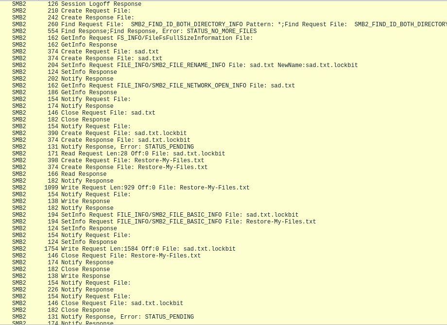

After encrypting a file, the malware will also leave a ransom note in a file "Restore-My-Files.txt" which will contain instructions for users to pay the ransom and recovery their files.


The ransom note will contain an onion link to the ransom site which will require the user to install the Tor browser to enter. However, the link seems to be down, indicating that the domain is not up anymore/changed:


After encrypting all the files, the malware will change the background of the machine and delete itself, preventing itself from being analysed by analysts.


After all of these, if the company do not have any other sources of backup to restore from, they will not be able to recover their files on their own and can only be forced to pay the ransom in order to recover their files, assuming the ransomware operators keep their end of the deal and recover their files for them, causing massive losses to the company

### Host indicators of compromise

Here are the possible Host IOCs:

* Presence of files with .lockbit extensions and encrypted content within these files
* Presence of Restore-My-Files.txt in all directories with encrypted files
* Presence of the following registry keys:
  * HKCU\Software\Microsoft\Windows\CurrentVersion\Run\XO1XADpO01: "C"
  * Software\LockBit\Public
  * Software\LockBit\full
  * HKEY\_LOCAL\_MACHINE\SOFTWARE\WOW6432Node\Microsoft\Windows
  * NT\CurrentVersion\ICM\Calibration
* Change of desktop background to the following picture:


* background changed by the malware
* Recovery disabled
* Missing/deleted backups
* System backup state missing
* Previous versions of drives also missing

#### YARA rules

```
rule test{
    meta:
    Description = "search for LockBit ransomware"
    strings:
    $a = {4d 5a}
    $b = {2C 70 7E 49 5F 58 43 5E 49 01 61 55 01 6A 45 40} // Restore-My-Files.txt
    $c1 = {7E 3F 12 12 5E 07 11 0B 0C 5E 17 13 0E 11 0C 0A} //ransom text
    $c2 = {1F 10 0A 5E 18 17 12 1B 0D 5E 1F 0C 1B 5E 1B 10}
    $c3 = {3D 30 37 69 55 54 4E 1D 51 54 53 56 1D 52 53 51}
    $c4 = {44 1D 4A 52 4F 56 4E 1D 54 53 1D 69 52 4F 1D 7F}
    $c5 = {73 32 1F 1F 53 0A 1C 06 01 53 15 1A 1F 16 00 53}
    $c6 = {12 01 16 53 16 1D 10 01 0A 03 07 16 17 53 11 0A}
    $d1 = {33 1C 50 13 44 51 52 57 5E 5A 5D 13 77 76 7F 76} // /c wbadmin DELETE SYSTEMSTATEBACKUP
    $d2 = {0B 24 68 2B 7D 78 78 6A 6F 66 62 65 2B 4F 6E 67} // /c vssadmin Delete Shadows /All /Quiet
    $d3 = {7E 51 1D 5E 1C 1D 1A 1B 1A 17 0A 5E 51 0D 1B 0A} // /c bcdedit /set {default} recoveryenabl
    $d4 = {2C 03 4F 0C 4E 4F 48 49 48 45 58 0C 03 5F 49 58} // /c bcdedit /set {default} bootstatuspol
    $e = {1B 48 54 5D 4F 4C 5A 49 5E 47 57 74 78 70 59 72} // SOFTWARE/Lockbit
    $f0 = {74 6D DD 6E 07 C0 75 4E B7 6A E5 74 09 95 E2 4C}
    $f1 = {95 D1 16 0A 47 6F 64 49 92 87 9F 4B AB 6D 98 27}
    condition:
    $a and $b and (4 of ($c*)) and (all of($d*)) and $e and (all of($f*))
}
```


### Network Indicators of Compromise

Attempts to connect to all IPs in the same /24 subnet as the machine itself at port 445/135

#### Snort rules

```
alert tcp any any -> any 135 (msg:"LOCKBIT";flow:to_server,established;content:"|6c 00 6f 00 63 00 6b 00 62
alert tcp any any -> any 445 (msg:"LOCKBIT";flow:to_server,established;content:"|6c 00 6f 00 63 00 6b 00 62
alert tcp any any -> any 135 (msg:"LOCKBIT";flow:to_server,established;content:"|52 00 65 00 73 00 74 00 6f
alert tcp any any -> any 445 (msg:"LOCKBIT";flow:to_server,established;content:"|52 00 65 00 73 00 74 00 6f
```

### Appendix

### Appendix A

```
class decode{
    public static void main(String[] args) {
        String yes = "6372686B442762716E736662754407"; //hex bytes, with first byte at the end
        int[] nums = new int[(int) Math.ceil(yes.length()/2)];
        int c = 0;
        for(int i = yes.length() - 1;i>0;i-=2){
            nums[c++] = Integer.parseInt(yes,i-1,i+1,16);//get hex numbers
        }
        String sad = "";
        for(int i=1 ;i<nums.length;i++){
            sad = sad.concat(Character.toString((char) (nums[0] ^ nums[i])));//decrypt the hex values and a
        }
        sad = Character.toString((char)nums[0]).concat(sad);
        System.out.println(sad);//print result
    }
}

```

```
class decodeString{
    public static void main(String[] args) {
        String yes = "O<6!,b;.<$-.=";// string value found
        int[] nums = new int[yes.length()];
        String sad = "";
        for(int i=1 ;i<nums.length;i++){
            sad = sad.concat(Character.toString(yes.charAt(0) ^ yes.charAt(i)));
        }
        sad = Character.toString((char)nums[0]).concat(sad);
        System.out.println(sad);
    }
}
```

```
# used when decryption looks like the following(below this code snippet)
with open("sad/test.txt","r")as f:
sad = f.read().split("\n")
num = int(sad[0])
string = []
for i in range(sad.__len__()): # two rounds of encryption
if i == 0:
continue
string.append(num ^ int(sad[i]))
for x in string:
print(chr(num ^ x),end="")
```

.png>)

### Appendix B

Processes/services killed:

* Wrapper
* DefWatch
* ccEvtMgr
* ccsetMgr
* SavRoam
* Sqlservr
* sqlagent
* sqladhlp
* Culserver
* RTVscan
* sqlbrowser
* SQLADHLP
* BIDPService
* ntuit.QuickBooks.FCS
* BCFMonitorService
* zhudongfangyu
* sqlwriter
* msmdsrv
* tomcat6
* vmware-usbarbitator64
* vmware-converter
* dbsrv12
* dbeng8
* MSSQL$MICROSOFT##WID
* MSSQL$VEEAMSQL2012
* SQLAgent$VEEAMSQL2012
* SQLBrowser
* SQLWriter
* FishbowlMySQL
* MSSQL$MICROSOFT##WID
* MSSQL$KAV\_CS\_ADMIN\_KIT
* MSSQLServerADHelper100
* SQLAgent$KAV\_CS\_ADMIN\_KIT
* msftesql-Exchange
* MSSQL$MICROSOFT##SSEE
* MSSQL$SBSMONITORING
* MSSQL$SHAREPOINT
* MSSQLFDLauncher$SBSMONITORING
* MSSQLFDLauncher$SHAREPOINT
* SQLAgent$SBSMONITORING
* SQLAgent$SHAREPOINT
* QBFCService
* sqlmangr
* supervise
* RAgui
* Culture
* winword
* QBDBMgr
* QBW32
* qbupdate
* axlbridge
* fdlauncher
* httpd
* MsDtSrvr
* java
* 360se
* 360doctor
* wdswfsafe
* fdhost
* GDscan
* ZhuDongFangYu
* QBDBMgr
* mysqld
* AutodeskDesktopApp
* acwebbrowser
* Creative Cloud
* Adobe Desktop Service
* Coresync
* node
* sync-taskbar
* sync-worker
* InputPersonalization
* AdobeCollabSync
* BrCtrlCntr
* BrCcUxys
* SimplyConnectionManager
* Simply.SystemTrayIcon
* ONENOTEM
* fbserver
* fbguard

### Appendix C

Blacklisted files (will not be encrypted by malware):

* By file name:
  * .
  * ..
  * Restore-My-Files.txt
  * ntldr
  * ntuser.dat.log
  * bootsect.bak
  * autorun.inf
* By Directory
  * $windows.\~bt
  * intel
  * msocache
  * $recycle.bin
  * $windows.\~ws
  * tor browser
  * boot
  * system volume information
  * perflogs
  * google
  * application data
  * windows
  * windows.old
  * appdata
  * Windows nt
  * Msbuild
  * Microsoft
  * All users
  * mozilla
* By extensions
  * .386
  * .cmd
  * .exe
  * .ani
  * .adv
  * .theme
  * .msi
  * .msp
  * .com
  * .diagpkg
  * .nls
  * .diagcap
  * .lock
  * .oca
  * .mpa
  * .cpl
  * .mod
  * .hta
  * .icns
  * .prf
  * .rtp
  * .diagcfg
  * .msstyle
  * .bin
  * .hlp
  * .shs
  * .drv
  * .wpx
  * .bat
  * .rom
  * .msc
  * .spl
  * .ps1
  * .msu
  * .ics
  * .key
  * .mp3
  * .reg
  * .dll
  * .ini
  * .id
  * .sys
  * .hlp
  * .ico
  * .lnk
  * .rdp
