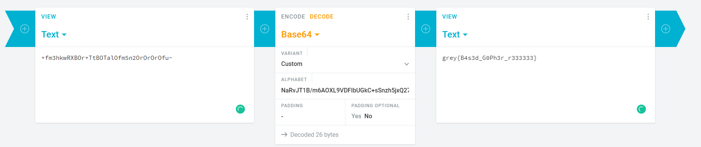

# njRAT

### Introduction

njRAT, or Bladabindi is a remote access trojan made by an organization called which allows attackers to gain control of the infected computers and logging activities on them. It has been used in multiple attacks and campaigns across the Middle East, India and South America. The following are some articles documenting the attacks:

* [https://www.trendmicro.com/en\_us/research/21/i/apt-c-36-updates-its-long-term-spam-campaign-against-south-ameri.html](https://www.trendmicro.com/en\_us/research/21/i/apt-c-36-updates-its-long-term-spam-campaign-against-south-ameri.html)
* [https://www.firstpost.com/tech/news-analysis/hacking-virus-bladabindi-targets-windows-users-in-india-steals-personal-info-cert-in-3654589.html](https://www.firstpost.com/tech/news-analysis/hacking-virus-bladabindi-targets-windows-users-in-india-steals-personal-info-cert-in-3654589.html)

### Analysis

The executable analysed is a 32 bit .NET assembly which was compiled on 22/4/2022:

 (1).png>)

For the next few parts I will be using DNspy to analyse the executable

#### Program Structure:

The executable has one namespace consisting of 4 classes, where the main function can be found in A:


#### Start

When program is started, the program will call OK.ko:

 (1).png>)

Within OK.ko it will conduct the following activities:

* Set a registry value under CurrentUser with the name "di" and value "!"

.png>)

* Creates a mutex with the name "7bd1aaab6b556fa08b3bb1be02a18c3d" and checks whether if it is a new mutex name. If yes, the program stops executing to prevent reinfection



* If it is started from "%AppData%\lsass.exe", it will proceed to attempt to allow itself through the firewall and add itself to autorun keys to allow it to be started on boot
  * If not, it will copy itself to said location and name and execute the path before stopping itself
  * Autorun key name will be  "7bd1aaab6b556fa08b3bb1be02a18c3d" which is also the mutex name

 (1).png>)

 (1).png>)

* It will also start 3 threads
  * 1st thread will be communicating with the C2 to receive instructions and execute them, returning the results to the C2
  * 2nd thread will be a keylogger that tracks what the user types
  * The last thread will be used to protect the program from stopping
* After starting the 3 threads, it will also track whether its autorun key is tampered with/deleted and will correct it if it was tampered with/deleted.

### Key Activities

#### Thread 1: Main C2 of server

When this thread is started, the program attempts to connect to Decation-30739.portmap.host at port 30739 until it is successful. Once connected, the program will send the following back to the C2:

 (1).png>)

This is probably a config which contains the host,port, the starting location and various true/false string. This is probably used for the C2 to know what is being enabled on this variant of the RAT to know what commands to send over to the RAT later on.

Thereafter the program will start receiving and executing commands from the c2, with the command and parameters for the command being separated by "|'|'|".

Here are some of the interesting commands available on the program:

* Launch new process

.png>)

* Set new homepage for Internet Explorer

.png>)

* Shutdown/restart computer
* Logoff

.png>)

* Enable/disable the following
  * Keyboard + mouse (via apiBlockInput)
  * Command prompt
  * Registry tools
  * Task manager
  * System Recovery

.png>)

.png>)

* Swap Mouse buttons
* play music/beep

.png>)

* speak via TTS (via SAPI.Spvoice)

.png>)

* turn on/off monitor

.png>)

* repeatedly ping an IP address at a certain port via UDP(can be used for DDoS)

.png>)

* Send keystrokes collected from the keylogger thread (encoded in base64)

.png>)

* Take a screenshot and send it back to C2

.png>)

* Uninstall itself

.png>)

Other than these features, the program also features a plugin system and also downloads an exe from dropbox

**Pass.exe**

When the "pass" command is sent, the program will download an exe from "https://dl\[.]dropbox\[.]com/s/p84aaz28t0hepul/Pass.exe?dl=0" which will be saved to "%temp%/pass.exe" which will then be executed. However, the link was blocked by dropbox and there is no sign of it on the internet . Hence, I was unable to analyse the executable. However, if it does executes, the program will read the results from "%temp%/temp.txt" and send them back to the C2.

.png>)

Other than pass.exe, the program also allows the download of other exes and execute them on the computer which is saved in the temp directory

.png>)

**Plugins**

The program also allows the C2 to upload plugins to the program and execute them, returning the results back to the C2. The program will call the "start" method within the executable.&#x20;

.png>)

**Self-Update**

The program has a self update feature that allows the attacker to upload an "update" of the current program which has bug fixes/new features, after doing so, the program will execute the updated program and terminate and delete itself afterwards.

.png>)

#### Thread 2: Keylogger

This thread will continuously log keystrokes that are being entered on the infected machine. The logs will also contain the window name and time that the keystrokes are being entered. This will then be stored in a variable and sent back to C2 when instructed.

 (1).png>)

This will allow attackers to gather sensitive information such as emails and password which can be used to login into the victim's account and steal more information/ money.


#### Thread 3

This thread is made to prevent the user for checking the presence of the program via tools such as task manager/process explorer/process hacker. This thread regularly checks for the presence of such programs by checking the foreground window process and check for the name of the process. If the process is a banned process, the program will proceed to terminate it.

The code use for the thread is shown below:

```
for (;;){
	Thread.Sleep(200);
	IntPtr foregroundWindow = mgr.GetForegroundWindow();
	bool flag = foregroundWindow.ToInt32() == 0;
	if (!flag)
	{
		int num = 0;
		mgr.GetWindowThreadProcessId(foregroundWindow, ref num);
		flag = (num > 0);
		if (flag)
		{
			int windowTextLength = mgr.GetWindowTextLength((int)foregroundWindow);
			flag = (windowTextLength == 0);
			string text;
			if (flag)
			{
				text = "";
			}
			else
			{
				StringBuilder stringBuilder = new StringBuilder(windowTextLength + 1);
				int windowText = mgr.GetWindowText((int)foregroundWindow, stringBuilder, stringBuilder.Capacity);
				flag = (windowText == 0);
				if (flag)
				{
					text = "";
				}
				else
				{
					text = stringBuilder.ToString();
				}
			}
			Process processById = Process.GetProcessById(num);
			flag = (Operators.CompareString(processById.ProcessName.ToLower(), "taskmgr", false) == 0 | Operators.CompareString(processById.ProcessName.ToLower(), "processviewer", false) == 0 | Operators.CompareString(processById.ProcessName.ToLower(), "processhacker", false) == 0 | Operators.CompareString(text.ToLower(), "process explorer", false) == 0);
			if (flag)
			{
				List<IntPtr> list = new List<IntPtr>();
				int num2 = 0;
				foreach (IntPtr intPtr in this.GetChild(foregroundWindow))
				{
					string text2 = Strings.Space(200);
					int className = mgr.GetClassName((int)intPtr, ref text2, 200);
					text2 = text2.Remove(className, 200 - className);
					flag = (Operators.CompareString(text2.ToLower(), "button", false) == 0);
					if (flag)
					{
						list.Add(intPtr);
					}
					flag = (Operators.CompareString(text2.ToLower(), "static", false) == 0 | Operators.CompareString(text2.ToLower(), "directuihwnd", false) == 0);
					if (flag)
					{
						num2++;
					}
				}
				flag = (list.Count == 2 & (num2 == 2 | num2 == 1));
				if (flag)
				{
					mgr.EnableWindow(list[0], false);
					int hwnd = (int)list[0];
					int wMsg = 12;
					int wParam = 0;
					string text3 = "End process";
					mgr.SendMessage(hwnd, wMsg, wParam, ref text3);
				}
			}
		}
	}
}
```

### Indicators of Compromise:

#### Files:

* %AppData%/lsass.exe
* %temp%/pass.exe

#### Registry:

* HKCU\Software\7bd1aaab6b556fa08b3bb1be02a18c3d
* HKCU\Software\Microsoft\Windows\CurrentVersion\Run\7bd1aaab6b556fa08b3bb1be02a18c3d

#### Mutex:&#x20;

7bd1aaab6b556fa08b3bb1be02a18c3d

#### Network:

TCP connection to Decation-30739.portmap.host at port 30739&#x20;
